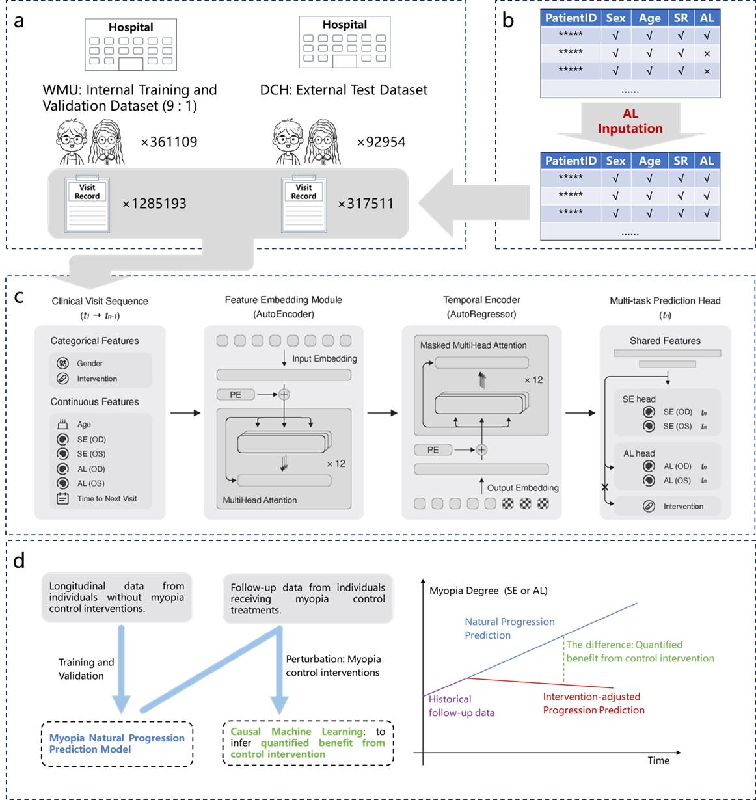

# AI-guided Personalized Predictions on Myopia Progression and Interventions

<p>
    <a href="https://github.com/YuxingLu613/Myopia-Casual-Prediction/stargazers"></a>
    <a href="https://github.com/YuxingLu613/Myopia-Casual-Prediction/network/members"></a>
    <a href="https://github.com/YuxingLu613/Myopia-Casual-Prediction/issues"></a>
    <a href="https://github.com/YuxingLu613/Myopia-Casual-Prediction/commits/main"></a>
</p>
<p>
    <a href="https://www.python.org"></a>
    <a href="https://github.com/psf/black"></a>
    <a href="https://opensource.org/licenses/Apache-2.0"></a>
    <a href="https://doi.org/10.5281/zenodo.1234567"></a>
</p>


This repository provides a framework for AI-driven, personalized prediction of **myopia progression** and the evaluation of **intervention strategies** using electronic health record (EHR) data. The system is specifically designed to address the clinical and research challenges in understanding, forecasting, and managing myopia in pediatric and adolescent populations. It supports advanced deep learning models and modular experiment management.

<p align="center">
  
</p>

## Overview of the Algorithm and Pipeline

The pipeline is tailored to the unique requirements of myopia research and intervention assessment:

1. **Data Ingestion & Preprocessing**
   - EHR data including spherical equivalent (SE) and axial length (AL) for both eyes (OS, OD), as well as age and gender, are collected, cleaned, and structured for modeling.

2. **Dataset Construction**
   - The data is split into training and test sets, ensuring patient-level separation and temporal consistency. The pipeline supports longitudinal data, capturing the progression of myopia over time and the timing of interventions.

3. **Modeling**
   - The model is adapted to predict future myopia progression (e.g., change in spherical equivalent, axial length) and to estimate the effect of interventions.
   - The model can incorporate intervention events as features, enabling counterfactual analyses.

4. **Training**
   - Training includes monitoring clinically relevant metrics (e.g., mean absolute error) and supports early stopping and checkpointing.

5. **Evaluation & Prediction**
   - After training, the model is evaluated on held-out patients. Outputs include individualized trajectories, predicted effects of interventions.

6. **Experiment Management**
   - All experiments are configured via JSON files, and outputs (logs, checkpoints, predictions) are organized for reproducibility and comparison across different intervention strategies and cohorts.

## Example Usage

### Pipeline Flow

1. **Configuration:**
   - Define experiment settings in a JSON file under `configs/` (e.g., data paths, model parameters, outcome definitions, intervention types).

2. **Data Preparation:**
   - Place raw myopia-related EHR data in `data/raw_data/` and preprocess as needed into `data/processed/`.

3. **Run Pipeline:**
   - Launch the pipeline via `main.py`, which:
     - Loads configuration
     - Sets up data modules and model
     - Trains the model, saving logs and checkpoints in `output/`
     - Optionally evaluates and generates personalized predictions and intervention effect estimates

4. **Results & Analysis:**
   - Outputs (metrics, risk trajectories, intervention effect predictions, checkpoints) are stored in `output/` for further analysis and clinical interpretation.


Below are example bash commands for running the main stages of the pipeline:

### 1. Data Preparation

Prepare your data and place it in the appropriate directory:

```bash
# Place your raw EHR data in the data/raw_data/ directory
mkdir -p data/raw_data
cp /path/to/your/myopia_ehr_data.csv data/raw_data/

```

### 2. Training

Train the model using a configuration file (e.g., configs/train_reg.json):

```bash
python main.py --config configs/train_reg.json
```

### 3. Evaluation / Testing

After training, evaluate the model on the test set:

```bash
python main.py --config configs/train_reg.json --test
```

- Training and evaluation logs, checkpoints, and predictions will be saved in the `output/` directory.

## Key Concepts

- **Personalized Myopia Progression Prediction:** The pipeline is designed to forecast individual patient trajectories of myopia progression, leveraging longitudinal EHR data, risk factors, and prior interventions.
- **Intervention Effect Modeling:** By explicitly modeling intervention events (e.g., medication, optical treatments), the system can estimate and compare the likely impact of different strategies on myopia progression.
- **Clinical Relevance:** Outputs are tailored for clinical and research use, supporting risk stratification, early identification of fast progressors, and decision support for intervention planning.
- **Scalability & Reproducibility:** Distributed training and modular design allow the system to scale to large, multi-center datasets, while experiment configuration and output management ensure reproducibility.

## High-Level File Tree

```
.
├── configs/           # Experiment configuration files (JSON)
├── data/              # Raw and processed EHR data
│   ├── raw_data/      # Original data files (including myopia measurements and intervention records)
│   └── processed/     # Preprocessed data ready for modeling
├── output/            # Model outputs, logs, and checkpoints
│   └── SEAL/          # Example output subfolder
├── ddp_Utils.py       # Utilities for distributed training and communication
├── ehr_dataset.py     # Data pipeline: loading, batching, and dataset management
├── ehr_model_module_pretrain.py # Model training and evaluation pipeline (LightningModule)
├── ehrformer.py       # Model architecture: EHRFormer and related modules
├── loss.py            # Custom loss functions (e.g., for progression and intervention effect)
├── main.py            # Entry point: orchestrates the full pipeline
├── Utils.py           # General utilities (I/O, seeding, etc.)
```
